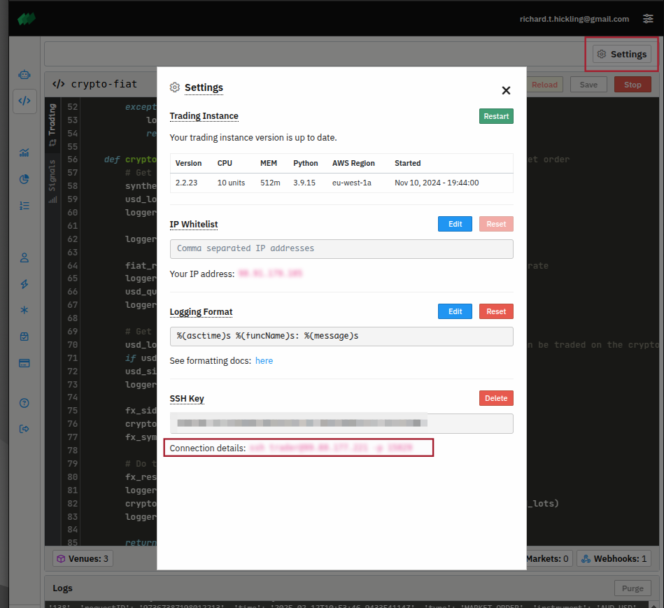

See [our blogs](https://profitview.net/blog) for more articles like this.

In my previous blog posts, I demonstrated some relatively esoteric trading strategies, such as using [AI News signals](https://profitview.net/blog/what-i-learned-when-building-an-ai-news-trading-bot) and building [DeFi vaults](https://profitview.net/blog/how-i-used-deepseek-to-build-a-profitable-defi-trading-algorithm-in-one-morning). I wanted to show just how flexible and extensible ProfitView is when it comes to algorithmic trading.

Currently, **ProfitView supports crypto exchanges** out of the box. However, because the algo platform provides **full Python 3** support, you can extend ProfitView to other asset classes yourself, before we officially add direct support. Of course, those who rely on "Bots" (which require built-in exchange connections) can't directly do this. But if you're using the Trading side of the platform, you're in full control of execution logic—which means you can connect to any broker API that Python can handle.

## Revisiting the BitMEX Grid Bot

Writing this blog reminded me of our [BitMEX webinar](https://profitview.net/events/getting-started-with-trading-bots). In preparation for that webinar, I built a simple grid trading algorithm. There was some boilerplate code back then that our **Signal** system now makes unnecessary. However, to bring in other, non-crypto platforms, I couldn't simply rely on the Signal system alone. It would be helpful to re-use some of that older webinar code for this multi-venue approach.

Of course, you never want to just copy and paste. A better approach is to **abstract common code** into a package and import that package into any new algos—keeping your code DRY (Don't Repeat Yourself).

---

## Abstracting the Common Code

The original BitMEX grid bot from the webinar is available on our [GitHub repo](https://github.com/profitviews/grid-bot) under `src/webinar/2/Starter.py`. The main part I wanted to reuse is the `Venue` class, which wraps exchange-specific details like:

- Tick and lot sizes  
- API rate-limits  
- Other exchange nuances  

By centralizing these details, you can write higher-level trading logic without worrying about all the fiddly exchange details in each new algorithm.

**But how do we share this code across algos in ProfitView, since our algo platform uses containers and "special" Python files?**  

### Creating and Sharing a Python Package in ProfitView

If you have an **ActiveTrader subscription**, you can connect directly to your container via `ssh`. This means you can create a reusable Python package locally and then transfer it into the container—where multiple algos can import it.

1. In the **Signals** tab of ProfitView, click **Settings**, and under **SSH Key**, you'll see the `ssh` command for connecting to your container.
2. Once you've connected, you can `scp` (secure copy) or otherwise upload your package files into your container's file system.



#### Using `sshfs` for Seamless Development

On Linux (Ubuntu) or macOS (and possibly Windows with extra tools), you can use [`sshfs`](https://github.com/libfuse/sshfs) to *mount* the remote container's filesystem locally. This makes iterative development painless: you can edit files in your usual local IDE, and simply copy updates into the container when you need to test.

For example, if you decide to mount the container at `~/bots`, you might run something like:

```bash
cd ~
sshfs -o reconnect,ServerAliveInterval=15,ServerAliveCountMax=3,kernel_cache,auto_cache \
  -p 12345 trader@12.34.56.78: bots
```	

(Adjust the port, username, and IP to match your container details.)

Then you could create a `my` package directory:

```bash
mkdir -p ~/bots/src/my
cp my/venues.py ~/bots/src/my
```

Now both your old BitMEX algo and any new algos can do `from my.venues import Venue` (or similar). Any updates you make are automatically reflected in the container on the fly as the algo is running.

## Incorporating Non-Crypto Venues

I wanted a real example of combining a **supported** crypto venue (BitMEX) with a **non-crypto** venue. I decided to try OANDA for Forex (FX), since they have a [REST API](https://developer.oanda.com/rest-live-v20). After setting up an account, I got basic REST calls working.

### Synthetic Currency Trading

My idea was to create a *synthetic currency* of the form `[crypto][fiat]`. Suppose you want to "sell" a non-USD fiat currency on an FX venue and simultaneously "buy" a crypto perpetual on an exchange, each side denominated in USD. The net effect is a position in `[crypto][fiat]`.

While I'd hoped to go further and show a fully automated trading algorithm, I hit a snag: I couldn't get OANDA's WebSocket to work. (If anyone at OANDA is reading this, I'd love some help!) OANDA's GitHub repo has a [py-api-streaming](https://github.com/oanda/py-api-streaming) example, but it seems unmaintained.

Still, I can demonstrate the general approach with a code snippet. Once you have a `Venue` that handles OANDA (for example, in `venues.py`), your trading logic can be as simple as:

```python
def crypto_fiat_trade(self, symbol, side, quantity):
    """Executes a synthetic market order that sells fiat for USD and buys crypto-perp for USD."""
    # Example structure: {'fx': 'EUR_USD', 'crypto': 'ETHUSD', 'lot': 237.0}
    synthetic = self.synthetics.get(symbol)
    
    # 'lot' is the notional size in USD used for the crypto side
    usd_lot = synthetic['lot']
    
    # Convert the input quantity (in fiat) to USD, based on the current FX rate
    fiat_rate = self.fx_venue.mark_price(synthetic['fx'])
    usd_quantity = quantity * fiat_rate
    
    # Calculate how many "lots" fit into that quantity
    usd_lots = math.floor(usd_quantity / usd_lot)
    if usd_lots == 0:
        return "Failure: quantity too small for crypto lot size"
    
    # If I'm selling crypto, I'd be buying fiat, etc.
    fx_side = "buy" if side == "sell" else "sell"
    
    # Execute on both venues
    fx_result = self.fx_venue.place_order(synthetic['fx'], fx_side, usd_lots * usd_lot)
    crypto_result = self.crypto_venue.place_order(synthetic['crypto'], side, usd_lots)
    
    return fx_result, crypto_result
```

The main bot script is here in `ProfitView/crypto-fiat.py`, while the library code lives in `my/venues.py`. I used a Jupyter notebook (`src/crypto-fiat.ipynb`) for initial development and testing.

## Conclusion and Next Steps

Even without a functioning WebSocket for OANDA, it's straightforward to combine venues for a *synthetic currency* approach, thanks to Python's flexibility and ProfitView's container system. If OANDA (or anyone else) can help me get the streaming API working, I'd love to write a fully automated multi-venue trading bot.

In a future blog post, I'll also show how to integrate **Alpaca** for equities. In the meantime, feel free to check out the code for this OANDA/BitMEX example, and explore how easy it is to abstract your code into a `my` package. With the power of SSH access and Python, **you** can add any asset class to your strategy stack—even before we officially support it.

If you have any questions or want to swap ideas, feel free to reach out!
