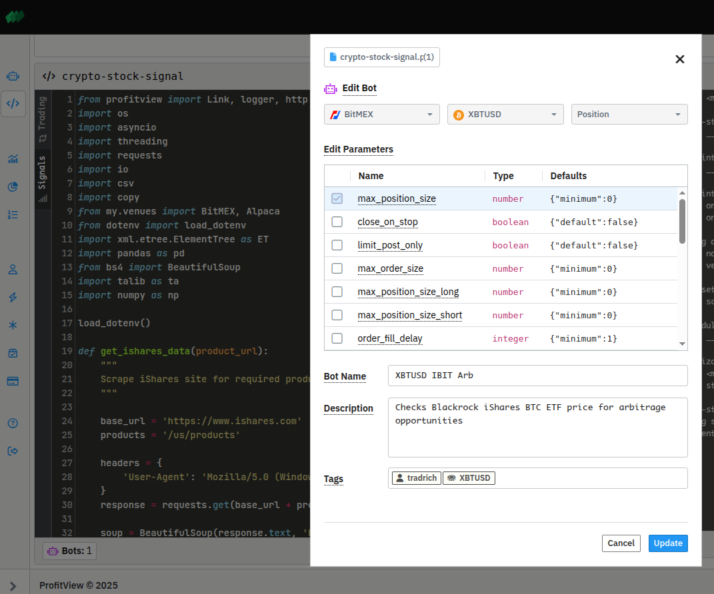

See [our blogs](https://profitview.net/blog) for more articles like this.

This blog will _effectively_ be an expansion on my previous one: [Multi-Asset Algorithmic Trading with Python: Extending ProfitView Beyond Crypto to OANDA Forex](https://profitview.net/blog/multi-asset-algorithmic-trading-with-python-extending-profitview-beyond-crypto-to-oanda-forex).  This time we'll be looking at the stock market, and more specifically the Bitcoin ETF of BlackRock.

This will give an opportunity to show how to use ProfitView but also, since we'll trade with Alpaca, the usage of its websocket streaming prices to construct a reasonable algo.

With the introduction of the BlackRock iShares Bitcoin ETF (IBIT), new trading opportunities have emerged for traders who understand how to spot and exploit pricing discrepancies. This blog post walks you through setting up an automated arbitrage strategy between the IBIT ETF and BitMEX's Bitcoin Perpetual Futures using ProfitView's platform.

We provide **all the code** and link you to a Bot that you can **run right now**.

## Understanding the Arbitrage Opportunity

The key concept behind this arbitrage strategy is comparing the implied price of Bitcoin from IBIT shares against the real-time Bitcoin perpetual futures market on BitMEX. When these two prices diverge significantly, an arbitrage opportunity arises.

It's important to note that some differences between the IBIT implied price and perpetual futures are expected due to factors such as market liquidity, trading hours, and underlying market structures. While these nuances are interesting and relevant, we won't delve deeply into them in this particular blog.

Further, we use prices from [IEX](https://www.iexexchange.io/) which are real-time, but represent only a small fraction of the market (it is available for free).

ProfitView's Python-based algorithmic trading interface provides the flexibility to develop complex automated strategies. Below, we'll explore the technical solution we've created for monitoring and acting upon these price differentials.  The code below is in this repo at [`ProfitView/crypto-stock-signal.py`](/ProfitView/crypto-stock-signal.py). It uses library `venues` which is in [`my/venues.py`](/my/venues.py).  Make sure you installe the [requirements](/requirements.txt).

## Technical Setup with ProfitView

Our arbitrage strategy relies on two core components:

### 1. Scraping Data from BlackRock iShares

To accurately calculate the implied Bitcoin price, we first retrieve two critical pieces of information:

- **Total Bitcoin Holdings**
- **Total Shares Outstanding**

This information is available on the iShares website. It can be extracted via "scraping".  In Python, the popular package [`BeautifulSoup`](https://pypi.org/project/beautifulsoup4/) can do this.  Because the ProfitView platform allows Bot creators full Python functionality including arbitary web access and (for those with an ActiveTrader account) the ability to install new packages with `pip`, BeautifulSoup is readily utilized.  iShares actually provide a CSV file with the requrired info:
```python
soup = BeautifulSoup(response.text, 'html.parser')
holdings_path = ""

for a in soup.find_all('a', href=True):
  if 'detailed holdings and analytics' in a.text.lower():
    holdings_path = a['href']
    break

file_response = requests.get(base_url + holdings_path, headers=headers)
```

The packages `csv` (part of Python) and `pandas` (provided by ProfitView) can conveniently be used to get the data.
The CSV file is in two sections - the "preamble" and main data.  First we get the shares:

```python
lines_in_preamble = 8
preamble = file_response.text.splitlines()[:lines_in_preamble]
shares_outstanding_string = ""
for line in csv.reader(preamble):
  if line and "Shares Outstanding" in line[0]:
    shares_outstanding_string = line[1].strip('"')
    break
shares_outstanding = int(float(shares_outstanding_string.replace(",","")))
```

We use `pandas` to get the Bitcoin count:

```python	
df = pd.read_csv(io.StringIO(file_response.text), skiprows=lines_in_preamble + 1)
btc_row = df[df['Ticker'] == 'BTC']
btc_held_string = btc_row['Quantity'].values[0]
btc_held = float(btc_held_string.replace(",",""))
```

### 2. Real-Time Price Streaming

Next, we establish a real-time stream of IBIT ETF quotes using Alpaca's WebSocket API integrated directly into ProfitView. This showcases ProfitView’s flexibility by using asynchronous programming (`asyncio`), WebSockets, and to bring in a custom library (`venues`) to handle real-time data efficiently.  We showed you how to use custom libraries in our [previous blog post](https://profitview.net/blog/multi-asset-algorithmic-trading-with-python-extending-profitview-beyond-crypto-to-oanda-forex).  We put the streaming logic together in `venues` and create a callback system to provide clients with a way to hook in their trading algo specifics.  All part of the ProfitView mantra of Make Traders Better™:
```python
def __init__(self, instruments, venue, api_key=None):
    # ...
		self.callbacks: List[Callable[[dict], None]] = []
```
Then the messy and venue specific websocket message handshaking and interpretation:
```python
message = await websocket.recv()
data = json.loads(message)
for msg in data:
    if msg.get("T") == "q":  # Quote message
        price_update = {
            "symbol": msg["S"],
            "bid": float(msg["bp"]),  # Bid price
            "ask": float(msg["ap"])   # Ask price
        }
        for callback in self.callbacks:
            callback(price_update)
    elif msg.get("T") == "error":
        logger.error(f"Stream error: {msg}")
        break
```
In client code you just have
```python
self.stock_venue.add_callback(self.on_ibit_price_update)  # Whatever local method the client wishes
```
in the constructor and then
```python
async def start_stream(self, symbols=["IBIT"]):
    await self.stock_venue.start_stream(symbols)
```
Then the client's code:
```python
def on_ibit_price_update(self, price_data):
  # ... algo code here
```
ProfitView is natively connected with BitMEX's data streams and uses the `quote_update()` method to get streamed Bitcoin perp prices.


## Calculating the Implied Bitcoin Price

With these data points, we calculate the implied Bitcoin price from IBIT:

```python
def implied_btc(share_price, total_btc_held, total_shares_outstanding):
    return share_price * total_shares_outstanding / total_btc_held
```

## Executing the Arbitrage

ProfitView's powerful signaling framework allows the strategy to send signals directly to the trading Bot when price deviations exceed a certain statistical threshold (e.g., ½ standard deviation from the mean). Here’s a simplified view:

```python
MIN_ZSCORE = 0.5

def calculate_size(zscore):
    if abs(zscore) < MIN_ZSCORE:
        return None
    return np.tanh((abs(zscore) - MIN_ZSCORE) * 1.5)

# Trading signals based on z-scores
if bid_zscore > MIN_ZSCORE:  # Premium
    if size := calculate_size(bid_zscore):
        size = -size  # Negative for selling
        self.signal('bitmex', 'XBTUSD', size=size)
elif ask_zscore > MIN_ZSCORE:  # Discount
    size = calculate_size(ask_zscore)
    if size := calculate_size(ask_zscore):
        self.signal('bitmex', 'XBTUSD', size=size)
else: self.signal('bitmex', 'XBTUSD', size=None)
```

This uses ProfitView's Position Bot type in a very simplistic way: it goes progressively long (up to the Bot user's configured maximum) based on the z-score between the IBIT implied price and Bitcoin perp bid quotes - and progressively short on the ask side.  Bot creators with more time would do a more nuanced and effective job of this - but this gives you the idea.

When I was testing the Signal I became very frustrated - everything seemed in place but I wasn't getting any IBIT data.  I poured over the code looking for bugs - then it suddenly started working. What? I twigged: it had just turned 9:30am in New York - the market openning!  I'd become so used to crypto's 24/7 hours...

Since ProfitView's Bot framework powers BitMEX's bots directly, anyone with a BitMEX account can run this Bot seamlessly without additional integrations. See the Bot in action on [BitMEX here](https://www.bitmex.com/app/trade/XBTUSD?botId=370ece8a-068a-4ed3-a8ca-13e60ec909ec&action=share).

The Bot automatically manages positions on BitMEX based on these signals, ensuring trades execute promptly to exploit price inefficiencies.

## Advantages of Using ProfitView

- **Flexibility**: Customizable Python scripts tailored to sophisticated arbitrage scenarios.
- **Automation**: Seamless integration with multiple trading venues and APIs.
- **Efficiency**: Real-time price monitoring and rapid execution to maximize arbitrage profits.
- **Bot Framework**: Algorithms can be distributed to arbitary numbers of simultaneous users, each using their own account balances and risk controls.



## Conclusion

By leveraging the IBIT Bitcoin ETF and BitMEX Perpetual Futures with ProfitView's robust trading infrastructure, traders can efficiently capitalize on fleeting arbitrage opportunities. This approach demonstrates the advanced capabilities of ProfitView in automating complex trading strategies and executing them at scale.

Try setting up your arbitrage Bot on ProfitView today, capture profitable trading opportunities - and share around the joy!